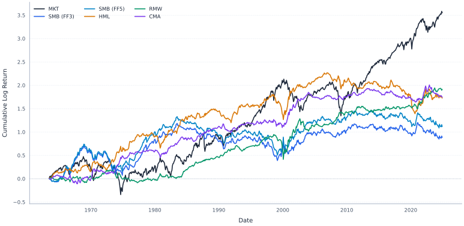
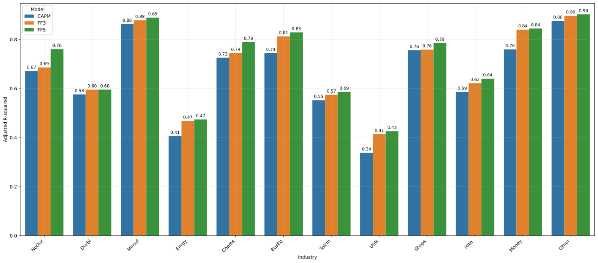
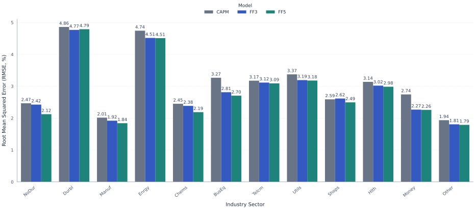

# Cross-Sectoral Sensitivities of Asset Pricing Models
### Empirical Evaluation of CAPM, Fama-French 3-Factor, and 5-Factor Models Across Industry Portfolios (1963–2024)

[](https://www.python.org/downloads/release/python-3120/)
[](LICENSE)
[](https://www.statsmodels.org/)
[](tests/)
[](https://mba.tuck.dartmouth.edu/pages/faculty/ken.french/data_library.html)

---

## 📌 Executive Summary & Abstract

This repository contains the complete empirical data science and econometric codebase for the Bachelor Thesis **"Evaluating Cross-Sectoral Sensitivities of Asset Pricing Models"** by **Nico Walendy** at the *Bonn-Rhein-Sieg University of Applied Sciences*.

The project investigates whether multi-factor asset pricing extensions—specifically the **Fama-French 3-Factor (FF3)** and **Fama-French 5-Factor (FF5)** models—demonstrate statistically significant advantages over the foundational **Capital Asset Pricing Model (CAPM)** when pricing 12 U.S. industry portfolios over a 60-year horizon (July 1963 – December 2024).

The analysis is conducted through two complementary lenses:
1. **In-Sample Explanatory Power:** Time-series OLS regressions with Heteroskedasticity and Autocorrelation Consistent (**HAC / Newey-West**) standard errors, joint and incremental Wald tests, diagnostic misspecification tests, and decade-by-decade parameter stability.
2. **Out-of-Sample Predictive Capability:** Expanding-window 1-month-ahead expected return forecasts, evaluating whether richer factor specifications reduce root-mean-squared error (RMSE) or suffer from parameter estimation noise.

---

## 🔍 Key Empirical Findings

* **Strong Cross-Sectoral Heterogeneity:** Market risk exposure ($\beta_{\text{MKT}}$) varies substantially across industries (e.g., defensive Utilities with $\beta < 0.6$ vs. High-Tech and Durables with $\beta > 1.2$).
* **Incremental Value of Size & Value (FF3 vs. CAPM):** 
  * The inclusion of Size ($SMB$) and Value ($HML$) factors provides statistically significant incremental explanatory power for most industrial and cyclical sectors (Incremental Wald test $p < 0.001$).
  * Average in-sample $R^2$ increases considerably when transitioning from CAPM to FF3.
* **Marginal Value of Profitability & Investment (FF5 vs. FF3):**
  * The addition of Robust-Minus-Weak Profitability ($RMW$) and Conservative-Minus-Aggressive Investment ($CMA$) factors improves fit primarily in consumer and manufacturing sectors.
  * In several industries, factor loadings for $RMW$ and $CMA$ are statistically insignificant, indicating model overparameterization for specific sectors.
* **The In-Sample vs. Out-of-Sample Divergence:**
  * While FF5 achieves the highest in-sample explanatory power ($R^2$), **it does not consistently outperform FF3 or CAPM out-of-sample**.
  * Out-of-sample forecast errors (RMSE) and paired $t$-tests reveal that parameter estimation uncertainty in expanding windows dampens the predictive accuracy of higher-dimensional factor models.

---

## 📊 Visual Showcase

### Cumulative Factor Dynamics (1963–2024)


### In-Sample Explanatory Power ($R^2$ Comparison Across Models)


### Out-of-Sample Predictive Accuracy (RMSE by Industry)


---

## 🏗 Repository Structure

```
.
├── Makefile                      # Standard shortcuts: make run, make test, make clean
├── pyproject.toml                # Modern PEP 517/621 build specification & dependencies
├── requirements.txt              # Pinned pip requirements
├── environment.yml               # Reproducible Conda environment specification
├── run_pipeline.py               # Unified CLI runner for end-to-end execution
├── data/
│   ├── raw/                      # Original Kenneth R. French monthly dataset files
│   ├── interim/                  # Expanding-window model parameters & forecast outputs
│   └── processed/                # Date-aligned, clean factor & industry CSV datasets
├── reports/
│   ├── figures/                  # Vector graphic visualizations (SVG)
│   ├── tables/                   # Econometric regression tables, Wald tests, metrics (CSV)
│   └── other/                    # Full regression summaries per model and industry (TXT)
├── src/                          # Modular Python source package
│   ├── config.py                 # Centralized path and model configuration
│   ├── data/                     # Ingestion, cleaning, date alignment & CAPM derivation
│   │   ├── data_capm.py
│   │   ├── data_processing.py
│   │   ├── data_tables.py
│   │   └── data_utils.py
│   └── modeling/
│       ├── in_sample/            # In-sample regressions, Wald tests & diagnostics
│       │   ├── expl_assumptions.py
│       │   ├── expl_bydecs.py
│       │   ├── expl_descript.py
│       │   ├── expl_incrwald.py
│       │   ├── expl_jointwald.py
│       │   ├── expl_plots.py
│       │   ├── expl_regress.py
│       │   ├── expl_tables.py
│       │   └── expl_utils.py
│       └── out_of_sample/        # Expanding window training & predictive evaluation
│           ├── pred_actpred.py
│           ├── pred_metrics.py
│           ├── pred_pairttest.py
│           ├── pred_plots.py
│           ├── pred_test.py
│           ├── pred_train.py
│           ├── pred_ttest.py
│           └── pred_utils.py
└── tests/                        # Automated Pytest suite
    ├── test_data.py              # Data integrity, date alignment, French 12 sector tests
    └── test_models.py            # Econometric OLS fitting, HAC SEs, Wald statistics tests
```

---

## ⚡ Quickstart & Reproducibility

### 1. Environment Setup

Clone the repository and install the dependencies in a dedicated environment:

```bash
# Option A: Conda
conda env create -f environment.yml
conda activate thesis_env

# Option B: Pip with editable package install
pip install -e .
```

### 2. Execute the Full Empirical Pipeline

Execute all three stages (Data Processing $\to$ In-Sample Econometrics $\to$ Out-of-Sample Forecasting) with a single command:

```bash
# Using Python CLI
python run_pipeline.py --all

# Or via Makefile
make run
```

### 3. Stage-by-Stage Execution

You can run individual stages as needed:

```bash
# Data preprocessing only
python run_pipeline.py --data

# In-sample regressions and Wald hypothesis tests only
python run_pipeline.py --in-sample

# Out-of-sample expanding window forecasts and Diebold-Mariano tests only
python run_pipeline.py --out-of-sample
```

### 4. Running the Test Suite

```bash
# Run all unit and integration tests
pytest tests/ -v

# Or via Makefile
make test
```

---

## 📐 Econometric Methodology

### Models Evaluated

1. **Capital Asset Pricing Model (CAPM - Sharpe, 1964; Lintner, 1965):**
   $$R_{i,t} - R_{f,t} = \alpha_i + \beta_{i,\text{MKT}} (R_{m,t} - R_{f,t}) + \varepsilon_{i,t}$$

2. **Fama-French 3-Factor Model (FF3 - Fama & French, 1993):**
   $$R_{i,t} - R_{f,t} = \alpha_i + \beta_{i,\text{MKT}} \text{MKT}_t + \beta_{i,\text{SMB}} \text{SMB}_t + \beta_{i,\text{HML}} \text{HML}_t + \varepsilon_{i,t}$$

3. **Fama-French 5-Factor Model (FF5 - Fama & French, 2015):**
   $$R_{i,t} - R_{f,t} = \alpha_i + \beta_{i,\text{MKT}} \text{MKT}_t + \beta_{i,\text{SMB}} \text{SMB}_t + \beta_{i,\text{HML}} \text{HML}_t + \beta_{i,\text{RMW}} \text{RMW}_t + \beta_{i,\text{CMA}} \text{CMA}_t + \varepsilon_{i,t}$$

### Statistical Inference & Diagnostics
- **Robust Standard Errors:** All in-sample hypothesis tests use Newey-West HAC covariance matrices to safeguard against autocorrelation and conditional heteroskedasticity in financial return time series.
- **Model Comparison:** Incremental Wald tests evaluate the null hypothesis $H_0: \beta_{\text{additional factors}} = 0$.
- **Out-of-Sample Forecasting:** Expanding-window OLS avoids look-ahead bias and simulates real-world recursive forecasting.

---

## 👤 Academic Citation & Contact

* **Author:** Nico Walendy
* **Institution:** Department of Management Sciences, Bonn-Rhein-Sieg University of Applied Sciences (H-BRS)
* **Supervisors:** Prof. Dr. Ralf Meyer & Prof. Dr. Thomas Deckers
* **Completion Date:** June 2025
* **License:** [MIT License](LICENSE)